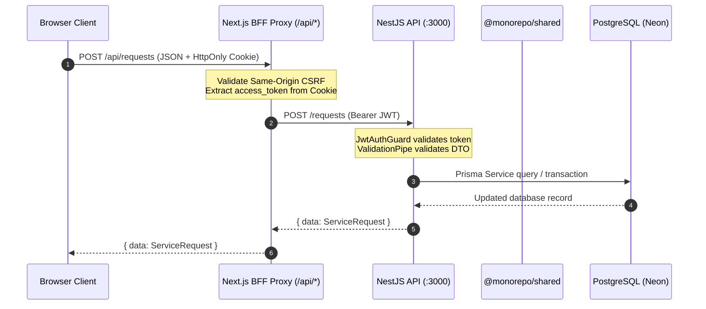

# System Architecture & Topology

## Overview

**Gobid** is a high-performance local service marketplace built around a **NestJS core API**, a **shared contract library**, two **Next.js frontends** (Web Marketplace and Admin Ops Dashboard) using the **BFF (Backend-for-Frontend) cookie proxy pattern**, and a **native iOS SwiftUI application**.

```
┌─────────────────────────────────────────────────────────────────────────────┐
│                            FRONTEND / CLIENT LAYER                          │
│                                                                             │
│  ┌───────────────────────┐   ┌───────────────────────┐   ┌───────────────┐  │
│  │   Web Marketplace     │   │  Admin Dashboard      │   │  iOS App      │  │
│  │   Next.js 16 (Port 3002)│ │ Next.js 16 (Port 3001)│   │  SwiftUI      │  │
│  └───────────┬───────────┘   └───────────┬───────────┘   └───────┬───────┘  │
└──────────────┼───────────────────────────┼───────────────────────┼──────────┘
               │ BFF HttpOnly Cookies      │ BFF HttpOnly Cookies  │ Bearer JWT
               │ `/api/[...path]` Proxy    │ `/api/[...path]` Proxy│ Header
               └─────────────┬─────────────┴───────────────────────┘
                             │
                             ▼
┌─────────────────────────────────────────────────────────────────────────────┐
│                              API / SERVER LAYER                             │
│                                                                             │
│                   ┌───────────────────────────────────────┐                 │
│                   │        NestJS API (Port 3000)          │                 │
│                   │   @gobid/api - Node 22 / Passport JWT │                 │
│                   └───────────────────┬───────────────────┘                 │
└───────────────────────────────────────┼─────────────────────────────────────┘
                                        │
             ┌──────────────────────────┼──────────────────────────┐
             ▼                          ▼                          ▼
┌────────────────────────┐  ┌───────────────────────┐  ┌───────────────────────┐
│     DATABASE LAYER     │  │     CACHE / QUEUE     │  │     STORAGE LAYER     │
│  PostgreSQL (Neon)     │  │  Redis 8 (:6380)      │  │ DigitalOcean Spaces   │
│  Prisma 7 ORM          │  │  BullMQ Queue Manager │  │ or Local Disk Uploads │
└────────────────────────┘  └───────────────────────┘  └───────────────────────┘
```

---

## 3-Tier Layer Architecture

### 1. Client & BFF Layer

- **Web Marketplace (`apps/web`)**: Next.js 16 (App Router), React 19, Tailwind CSS v4, TanStack Query. Provides public landing, request browsing, request creation, bidding, messaging, profile management, and support ticketing.
- **Admin Dashboard (`apps/admin`)**: Next.js 16 (App Router), React 19, Tailwind CSS v4, shadcn/ui. Provides administrative moderation, support desk queue, user management, and system status overview.
- **BFF Cookie Proxy Pattern**:
  - Web and Admin applications **never instantiate Prisma or query PostgreSQL directly**.
  - All client requests to NestJS API pass through Next.js App Router API route handlers (`app/api/[...path]/route.ts`).
  - Auth tokens are stored in `HttpOnly`, `SameSite=Lax`, `Secure` (in production) cookies (`access_token`, `refresh_token`).
  - The BFF proxy interceptor extracts the cookie token, attaches `Authorization: Bearer <accessToken>` to the upstream NestJS request, performs same-origin CSRF validation on mutating HTTP methods (`POST`, `PATCH`, `PUT`, `DELETE`), matches Nest path allowlists, and handles single-shot 401 token refresh automatically.
- **iOS Client (`ios-app/`)**: Native SwiftUI client using MapKit, URLSession, and Keychain token storage. Communicates directly with NestJS API using `Authorization: Bearer <token>` headers, with an internal coalesced `TokenRefresher` task queue.

### 2. Core API Layer (`apps/api`)

- **Framework**: NestJS 11 on Node 22, strict TypeScript.
- **Security & Validation**:
  - Global `JwtAuthGuard` applied across all routes, with `@Public()` escape hatch decorator for public endpoints.
  - Global `ValidationPipe` with `whitelist: true`, `forbidNonWhitelisted: true`, and `transform: true`.
  - Global `AllExceptionsFilter` mapping errors to standard JSON envelopes (`{ error: { message, code, requestId } }`).
  - Rate limiting enforced via `RateLimitGuard` using Redis Lua script.
  - Multipart upload routes enforce magic-byte MIME sniffing and signed HMAC URLs for private files.
- **Modules**:
  - `AuthModule`: Register, login, refresh, logout, password reset, user profile stats, socket token for realtime.
  - `RealtimeModule`: Socket.IO `/realtime` gateway, Redis adapter, presence, central `RealtimePublisher`.
  - `RequestsModule`: Requests lifecycle, bidding, job progress, request-level chat, reviews.
  - `CategoriesModule`: Public category directory.
  - `ConversationsModule`: Inbox, direct messaging, read tracking, archiving, pinning.
  - `NotificationsModule`: In-app notification list and category alerts.
  - `UsersModule`: Public profiles and user review history.
  - `DevicesModule`: APNs push device token registration.
  - `UploadsModule`: Public avatars/photos and private attachments signed with HMAC.
  - `SupportModule` / `AdminSupportModule`: User support tickets and admin support help-desk.
  - `AdminModule`: Moderation stats, user bans, request approvals, RBAC inspection.

### 3. Data & Infrastructure Layer

- **Database**: Managed PostgreSQL (Neon) via Prisma 7 ORM (`apps/api/prisma/schema.prisma`).
- **Cache & Task Queue**: Redis 8 backing sliding-window rate limiting, BullMQ 5 daily token cleanup jobs (`TokenCleanupProcessor`), Socket.IO Redis adapter for horizontally scaled realtime, and support typing / presence TTLs.
- **Realtime**: Dedicated `RealtimeModule` (`apps/api/src/realtime/`) exposes Socket.IO `/realtime` with JWT auth, room ACLs, and a `RealtimePublisher` called from REST services after durable writes. See [`docs/REALTIME.md`](REALTIME.md).
- **Media Storage**: Configurable local filesystem storage (development) or DigitalOcean Spaces S3 bucket (production).

---

## Data & Contract Flow



---

## Key Monorepo Packages

```
my-services-marketplace/
├── apps/
│   ├── api/          # @gobid/api (NestJS API server)
│   ├── admin/        # admin-panel (Next.js ops dashboard)
│   └── web/          # web (Next.js marketplace app)
├── packages/
│   └── shared/       # @monorepo/shared (Shared Zod contracts & types)
├── ios-app/          # Native SwiftUI iOS client
└── docs/             # Technical documentation suite
```
