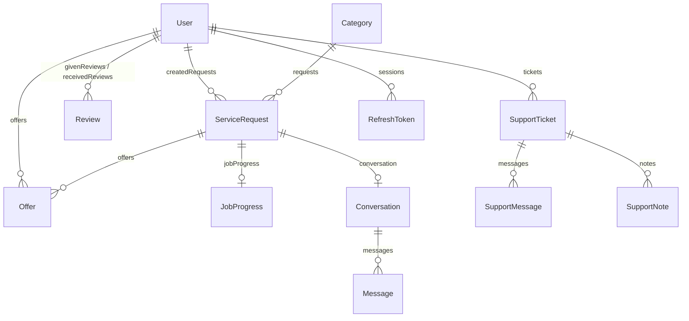

# Database Schema & Prisma Reference

## Overview

The database is powered by **PostgreSQL 18** and managed through **Prisma 7 ORM**. The authoritative database schema is located at:

```
apps/api/prisma/schema.prisma
```

---

## 1. Primary Data Models



| Model | Purpose | Critical Indexes & Unique Constraints |
|-------|---------|---------------------------------------|
| `User` | User accounts, auth & profiles | `email` (unique), `role` (`USER` \| `ADMIN`), `isBanned` |
| `RefreshToken` | Rotatable JWT refresh tokens | `token` (unique), `userId`, index on `expiresAt` for cron cleanup |
| `PasswordResetToken` | Password reset tokens | `token` (unique), index on `expiresAt` |
| `DeviceToken` | APNs push notification tokens | `token` (unique), `userId` |
| `Category` | Service classification catalog | `slug` (unique), `name`, `isActive` |
| `ServiceRequest` | Marketplace job listings | `ownerId`, `categoryId`, `status`, `city`, `pricingType` |
| `Offer` | Provider bids on service requests | `@@unique([requestId, offererId])`, `status`, `price` |
| `JobProgress` | Milestone execution tracker | `requestId` (unique), `offerId` (unique), `status` |
| `Conversation` | Inbox chat thread | `requestId` (unique), `user1Id`, `user2Id` |
| `Message` | Direct chat messages | `conversationId`, index on `[conversationId, createdAt]` |
| `SupportTicket` | Help desk tickets | `ticketNumber` (unique), `userId`, `status`, `priority` |
| `SupportMessage` | Customer support replies | `ticketId`, `senderId`, `createdAt` |
| `SupportNote` | Staff-only internal ticket notes | `ticketId`, `authorId`, `createdAt` |
| `Review` | Job rating & reviews | `@@unique([requestId, reviewerId])`, `receiverId`, `rating` |
| `AuditLog` | Administrative action audit trail | `userId` (`onDelete: SetNull`), `action`, `createdAt` |

---

## 2. Schema Workflow (`db push`)

In this project, schema changes are applied using **`prisma db push`** rather than traditional Prisma migration files.

### Standard Schema Change Steps

```bash
# 1. Edit the schema file: apps/api/prisma/schema.prisma

# 2. Regenerate Prisma Client
pnpm --filter @gobid/api db:generate

# 3. Push schema changes to database
pnpm --filter @gobid/api db:push

# 4. Optional: Seed database with updated data structures
pnpm --filter @gobid/api db:seed
```

> [!WARNING]
> Before executing `db push` against a shared or production database, take a database snapshot or backup (`pg_dump`) to prevent accidental data loss from destructive schema modifications.

---

## 3. Database Seeding (`db:seed`)

Seed script is defined in `apps/api/prisma/seed.ts`. It populates:

- Default Categories (Plumbing, Cleaning, Handyman, Moving, Electrical, Pet Care).
- Admin User: `admin@gobid.test` / `password123`.
- Demo Requesters & Providers with pre-populated service requests, offers, progress steps, reviews, and support tickets.
