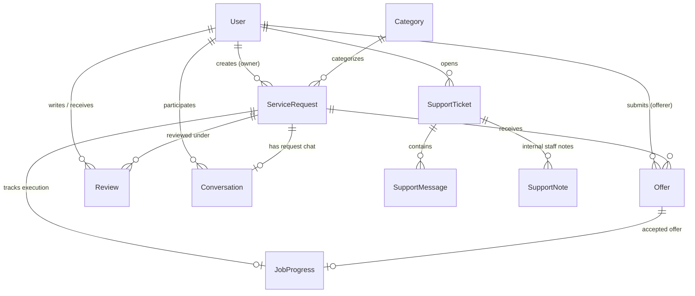
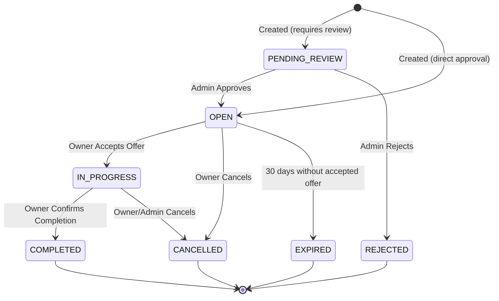
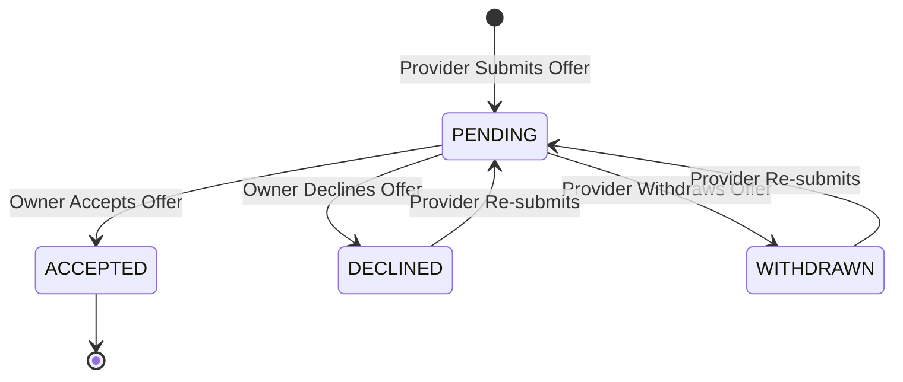
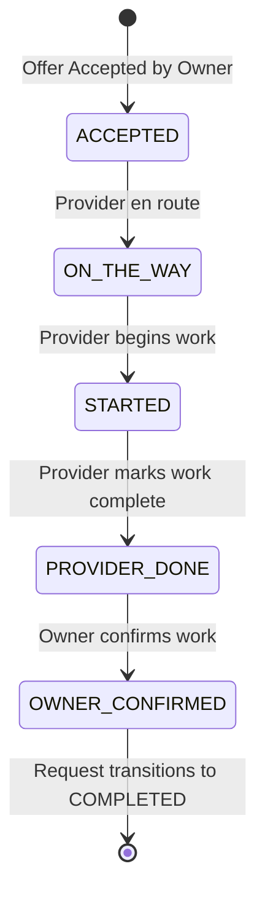
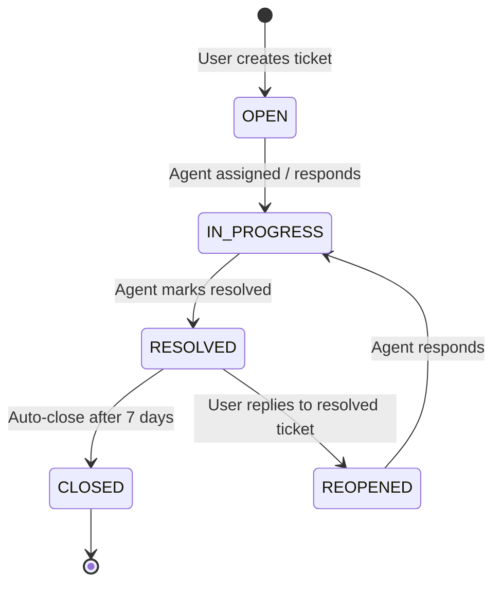

# Domain Model & State Machines

## Overview

Gobid is a two-sided marketplace connecting service requesters (homeowners, individuals needing assistance) with service providers (plumbers, cleaners, movers, handymen). 

---

## Core Entities & Relationships

### Entity Summary

| Entity | Model Name | Description | Key Fields / Statuses |
|--------|------------|-------------|-----------------------|
| **User** | `User` | Account profile for both requesters & providers | `email`, `role` (`USER` \| `ADMIN`), `isBanned`, `rating` |
| **Category** | `Category` | Catalog of service types (cleaning, plumbing, etc.) | `name`, `slug`, `icon`, `isActive` |
| **Service Request** | `ServiceRequest` | Job listing posted by a requester | `title`, `description`, `city`, `budget`, `status`, `pricingType` |
| **Offer** | `Offer` | Bid submitted by a service provider | `price`, `message`, `status` (`PENDING` \| `ACCEPTED` \| `DECLINED` \| `WITHDRAWN`) |
| **Job Progress** | `JobProgress` | Milestone execution tracker for an accepted request | `status` (`ACCEPTED` \| `ON_THE_WAY` \| `STARTED` \| `PROVIDER_DONE` \| `OWNER_CONFIRMED`) |
| **Conversation** | `Conversation` | Direct inbox or request-bound messaging thread | `requestId`, `user1Id`, `user2Id`, `isArchived`, `isPinned` |
| **Message** | `Message` | Chat message inside a conversation | `content`, `attachments`, `readAt` |
| **Review** | `Review` | Rating and review left after job completion | `rating` (1–5), `comment`, `reviewerId`, `receiverId` |
| **Support Ticket** | `SupportTicket` | Customer support help-desk issue | `subject`, `status`, `priority`, `assignedToId` |

---

## Formal State Machines

### 1. Service Request Lifecycle

**State Transition Rules**:
- Only listings in `OPEN` state are publicly browseable by default.
- Non-open requests (`PENDING_REVIEW`, `DRAFT`) are visible only to the owner or admins.
- Accepting an offer transitions the request to `IN_PROGRESS` and sets all other pending offers for that request to `DECLINED`.

---

### 2. Offer Lifecycle

**State Transition Rules**:
- Requesters cannot bid on their own service requests.
- A provider can only have **one active offer per request** (`@@unique([requestId, offererId])`).
- If an offer was previously `DECLINED` or `WITHDRAWN`, submitting a new price reactivates the offer row back to `PENDING`.

---

### 3. Job Progress Lifecycle

**State Transition Rules**:
- Milestones advance sequentially.
- Updating job progress uses **Compare-And-Swap (CAS)** conditional SQL updates (`updateMany` matching current status) to prevent race conditions.
- When `OWNER_CONFIRMED` is reached, the parent `ServiceRequest` status automatically updates to `COMPLETED`, allowing both parties to review each other.

---

### 4. Support Ticket Lifecycle

---

## User Roles & Binary RBAC

The system employs a strict **binary server-side RBAC model**:

- **`USER`**: Standard requester/provider account. Access restricted to owned resources, public marketplace listings, and user-level support endpoints.
- **`ADMIN`**: Platform administrator. Full access to `/admin/*` routes, user ban controls, request moderation (`approve`/`reject`), support desk administration, and system diagnostics.

> [!IMPORTANT]
> Admin navigation permissions (e.g. `users:read`, `requests:write`) gate UI navigation links only. Server-side access on `/admin/*` endpoints strictly requires `user.role === 'ADMIN'` enforced by `AdminGuard`.
